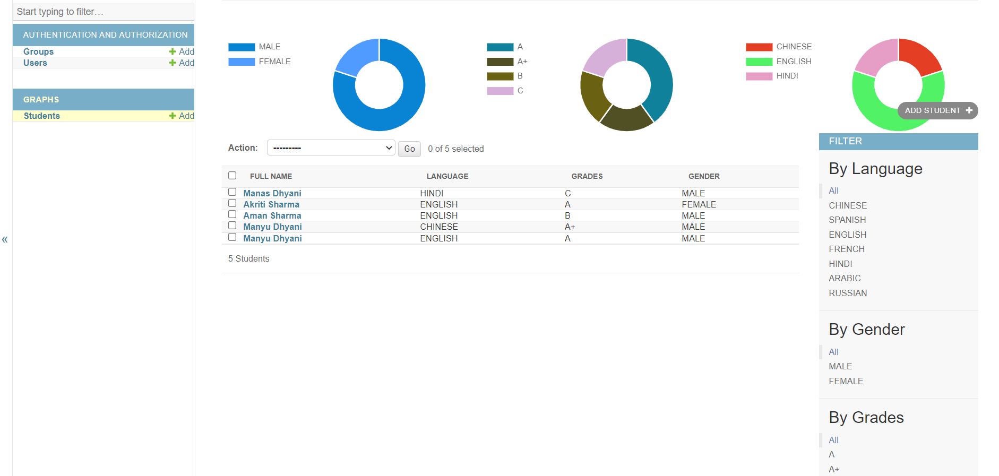
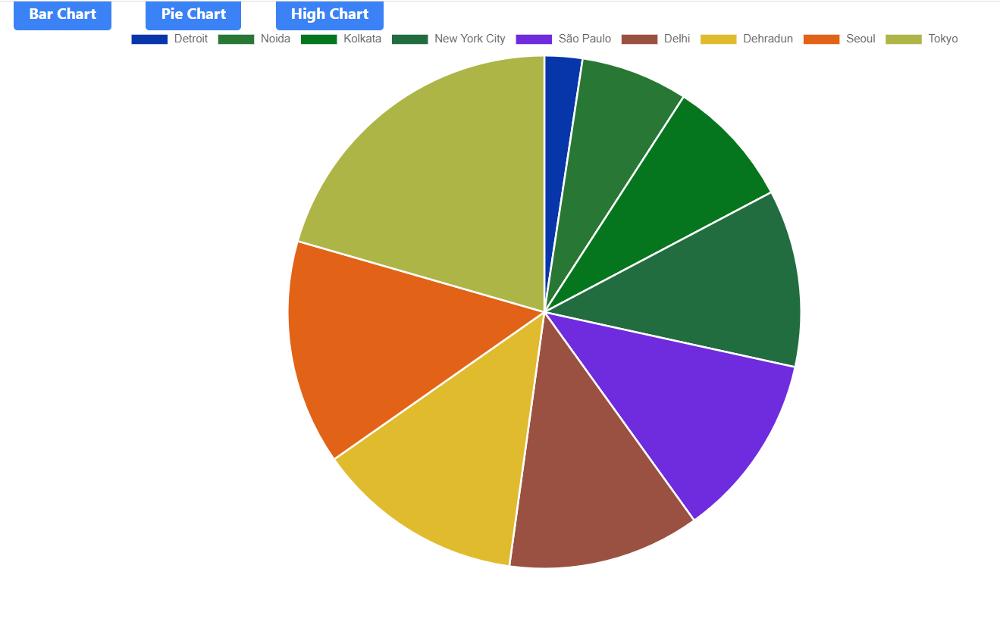
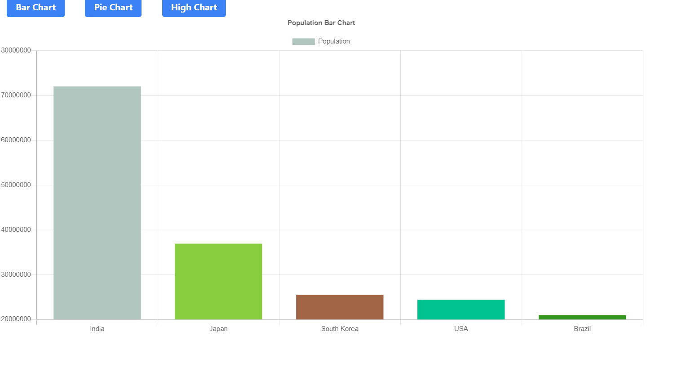
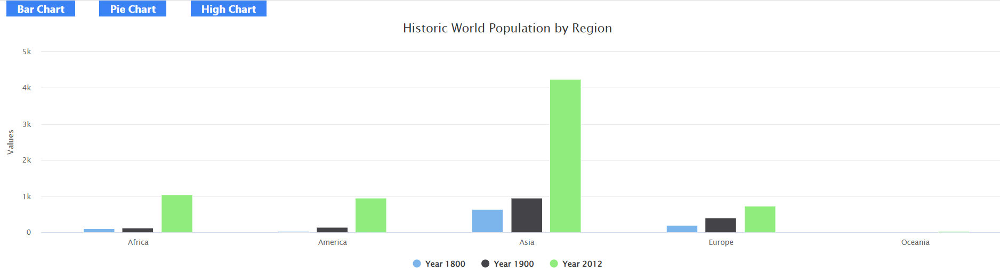

# Django-Admin-Graph-and-Customization

This project is on-Progress.

## Steps to run the project till current checkpoint:

### Setup a virtual env with requirements.txt.
### Run command: python manage.py makemigrations
### Run command: python manage.py makemigrations
### TO check out the administrator create a super user by using command: python manage.py createsuperuser
### Run command: python manage.py runserver

##Overview
The graph integrated to student table for Gender, Grades and Language (Subjects).

Pie Chart

Bar Graph

HighGraph

